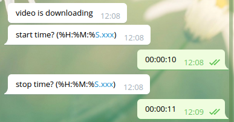

# youtube2gif

Hey, I am a great fan of animated Gifs and each time I watch a YouTube video I am thinking about a gif I could make from the video.  
That's why I create a Telegram bot for this purpose. Just send the link, the start time and stop time to the bot and it will send you back the gif.


## Getting started

### Important
For now, the bot is and mono-user and still under development. If you want to use it, you will have to make it run on your own server/aws/heroku and choose which users are allowed to use it.

The project can be run either on Heroku and Aws ec2.

### Prerequisite
You will have to create first a telegram bot i.e get a token from the bot father (TODO).

For the Python lib just follow the requirements.txt
```
pip install -r requirements.txt
```

You will need also the following packages under Ubuntu 16.04 : ffmpeg.
* on your own server : just install it the way you prefer (apt-get, ...)
* on heroku : ffmpeg is contained in the .buildpacks file and aims at this github :
https://github.com/jonathanong/heroku-buildpack-ffmpeg-latest.git


### Install
Clone the github.

## Running the tests
TODO

## Run

### Server side
* On you server : run the command line :  
```
python main.py
```
* On heroku : the process will be run when the app is deploy since it is in the ProcFile.

### User side
#### First time
Look up for the bot in the contact list and start conversation.
Send to the bot:
```
/start
```
Then it will ask you a YouTube link.  
  
Then it will ask you a start time 
Then it will ask you a stop time.  
  
Then it will process the gif and send it back.  
  
And here is the result.  
  


# Further improvements:
* better catch errors
* add limitation to prevent from creating to big gif that couldn't be sent
* add a turn-around to sent big gif
* allow multi-users
* move to a cleaner storage

# Acknowledgement
* Python-telegram-bot library
